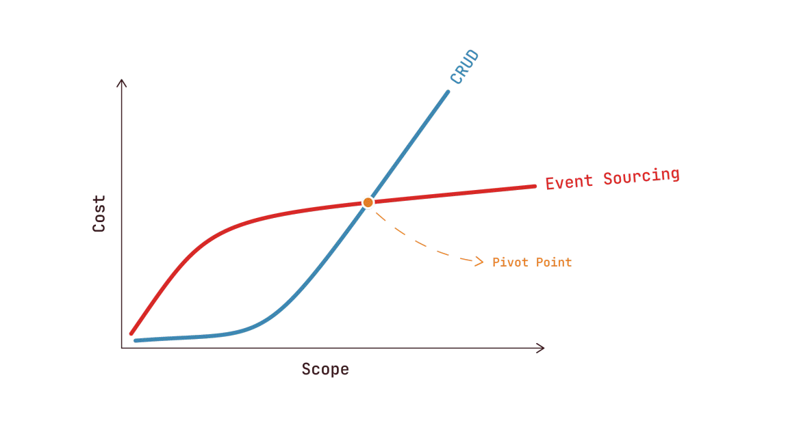
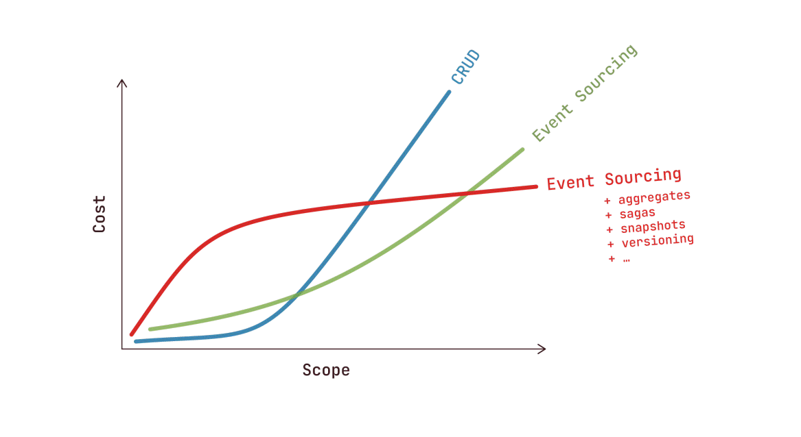

[назад](/chapters/intro.md)

---

# Начало с Event Sourcing

Для многих разработчиков event sourcing — это магический зверь, используемый для создания чрезвычайно сложных, часто распределенных проектов. И для этого есть веские причины: event sourcing — это паттерн, который заставляет код строиться так, чтобы он исключительно хорошо подходил для этих сложных проектов.

Слова "модульный", "распределенный", "масштабируемый" и "универсальный" приходят на ум, чтобы описать его — характеристики, без которых невозможно обойтись при создании приложений масштаба. Подумайте о популярном интернет-магазине или банке, обрабатывающих, возможно, тысячи, если не миллионы транзакций в секунду. Event sourcing чаще всего ассоциируется с такими проектами.

И поэтому event sourcing редко используется в небольших проектах: тех, с которыми сталкиваются многие разработчики, над которыми многие мои постоянные читатели блога работают ежедневно. Я думаю, это происходит из-за фундаментальной ошибки в том, что мы считаем event sourcing.

Когда я обсуждаю event sourcing, люди часто предполагают, что он связан со значительными накладными расходами, и что эти расходы не оправданы в небольших проектах. Они говорят, что существует некая точка перегиба, определяемая масштабом проекта, где event sourcing снижает затраты, в то время как в небольших проектах он привел бы к росту затрат.



И, конечно, это упрощение, но оно очень хорошо визуализирует аргумент: мы должны использовать event sourcing только в проектах, где уверены, что оно того стоит.

Проблема с этим утверждением в том, что оно говорит не только об event sourcing. Оно говорит об event sourcing со всеми его сопутствующими паттернами: агрегаты, саги, снимки, сериализация, версионирование, команды и т.д.

Вот почему я бы сказал, что наш график должен выглядеть примерно так:



Но имеет ли смысл использовать event sourcing без паттернов, которые строятся на нем? Существует веская причина для существования этих паттернов. Это вопросы, на которые я хочу ответить сегодня.

Вот видение Мартина Фаулера о том, что такое event sourcing:

Мы можем запросить состояние приложения, чтобы узнать текущее положение дел, и это отвечает на многие вопросы. Однако бывают времена, когда мы не просто хотим видеть, где мы находимся, но и знать, как мы сюда попали.

Event Sourcing гарантирует, что все изменения состояния приложения сохраняются как последовательность событий. Мы можем не только запрашивать эти события, но и использовать журнал событий для восстановления прошлых состояний и как основу для автоматической корректировки состояния с учетом ретроактивных изменений.

Фундаментальная идея Event Sourcing заключается в том, чтобы каждое изменение состояния приложения фиксировалось в объекте события, и чтобы эти объекты событий сами хранились в той последовательности, в которой они были применены, в течение всего срока жизни состояния приложения.

Другими словами: event sourcing — это о хранении изменений вместо их результата. Именно эти изменения составляют конечное состояние проекта.

При event sourcing ответ на вопрос "оформлен ли заказ" должен быть получен путем просмотра событий, связанных с этой корзиной, а не путем проверки статуса корзины.

Это звучит как накладные расходы, так в чем же преимущества такого подхода? Фаулер перечисляет три:

1.  **Полное перестроение (Complete Rebuild):** Состояние приложения можно выбросить и восстановить, просто просматривая события. Это дает огромную гибкость, когда вы знаете, что в будущем произойдут изменения в потоке программы или структуре данных — я приведу пример этого позже, так что не волнуйтесь, если сейчас это звучит абстрактно.
2.  **Временной запрос (Temporal Query):** Вы можете запрашивать сами события, чтобы увидеть, что произошло в прошлом. Есть не только конечный результат, но и сам журнал событий.
3.  **Воспроизведение событий (Event Replay):** Если вы хотите, вы можете внести изменения в журнал событий, чтобы исправить ошибки, и воспроизвести события с этого момента, чтобы восстановить корректное состояние приложения.

Однако в списке Фаулера не хватает одного важного момента: события моделируют время чрезвычайно хорошо. Они гораздо ближе к тому, как мы, люди, воспринимаем мир, чем CRUD.

Подумайте о каком-нибудь процессе в вашей повседневной жизни. Это может быть ваш утренний ритуал, поход за продуктами, возможно, вы посещали занятие или у вас было совещание на работе; подойдет что угодно, главное, чтобы в нем было несколько шагов.

Теперь попробуйте описать этот процесс как можно подробнее. Я возьму в качестве примера утренний ритуал:

- Я встаю в 5 утра
- Я чищу зубы — гигиена важна
- Я одеваюсь
- Я спускаюсь вниз, чтобы сделать кофе
- Я иду в свой домашний офис (с кофе)
- Затем я проверяю электронную почту
- Я начинаю писать эту книгу

Мыслить событиями для нас естественно, гораздо естественнее, чем иметь таблицу, содержащую состояние того, что происходит прямо сейчас, как в CRUD-подходе.

Если вы можете обнаружить "поток времени" в таком обыденном деле, как мой утренний ритуал, то что говорить о любых процессах в наших клиентских проектах? Бронирование, выставление счетов, управление запасами, как вы их называете; "время" очень часто является важнейшим аспектом, и CRUD не очень хорошо умеет им управлять, поскольку показывает только текущее состояние.

Я приведу вам пример того, насколько простым может быть event sourcing, без необходимости в каком-либо фреймворке или инфраструктуре, и где нет накладных расходов по сравнению с CRUD. На самом деле, их даже меньше.

У меня есть блог, и я использую Google Analytics для анонимного отслеживания посетителей, просмотров страниц и т.д. Конечно, я знаю, что Google не очень ориентирован на конфиденциальность, поэтому я экспериментировал с альтернативами. Однажды я задумался: вместо того чтобы полагаться на отслеживание на стороне клиента, не могу ли я просто полагаться на логи своего сервера, чтобы определить, сколько страниц было посещено?

Итак, я написал небольшой скрипт, который отслеживает мой лог доступа NGINX; он отфильтровывает такой трафик, как боты, краулеры и т.д., и сохраняет каждое посещение как строку в таблице базы данных. С каждым посещением связаны некоторые данные: URL, временная метка, User-Agent и т.д.

И это все.

О, вы ожидали большего? Ну, в итоге я написал еще немного кода, чтобы облегчить себе жизнь. По сути, то, что у нас здесь уже есть — это event sourcing. Я веду хронологический журнал всего, что произошло в моем приложении, и могу использовать SQL-запросы для агрегации данных, например, для отображения посещений в день.

Конечно, при миллионах посещений с течением времени выполнение необработанных SQL-запросов может стать утомительным, поэтому я добавил один паттерн, который строится на event sourcing — проекции (projections), также известные как "модель чтения" в CQRS.

Каждый раз, когда я сохраняю посещение в таблице, я также отправляю его как событие. Несколько подписчиков обрабатывают их; например, есть подписчик, который группирует посещения по дням и отслеживает их в таблице с двумя столбцами: день и счетчик. Это всего несколько строк кода:

```php
class VisitsPerDay
{
    public function __invoke(PageVisited $event): void
    {
        DB::insert('INSERT INTO visits_per_day (day, count) VALUES (?, ?) ON DUPLICATE KEY UPDATE count = count + 1', [
            $event->date->format('Y-m-d'),
            1,
        ]);
    }
}
```

Хотите посещения в месяц? По URL? Я просто создам новых подписчиков. Но вот в чем суть: я могу добавлять их после развертывания моего приложения и воспроизводить на них все ранее сохраненные события. Так что даже когда я изменяю свои проекторы или добавляю новые, я всегда могу воспроизвести их с момента, когда я начал сохранять события, а не только с момента развертывания новой функции.

Это было особенно полезно в начале: поступало много данных от ботов или трафика, который не был реальными пользователями. Я запустил скрипт на несколько дней, наблюдал за результатами, добавил дополнительную фильтрацию, удалил все данные проекций и просто воспроизвел все посещения заново. Так мне не нужно было начинать все заново каждый раз, когда я вносил изменения в данные.

Можете ли вы угадать, сколько времени потребовалось, чтобы настроить этот проекте event sourcing? Два часа, от начала до работающей продакшн-версии. Конечно, я использовал фреймворк для DBAL и шину событий, но ничего специфичного для event sourcing. В течение следующих нескольких дней я немного донастроил и добавил несколько графиков на основе моих таблиц проекций и т.д., но сама настройка event sourcing была очень простой.

Итак, вот что я пытаюсь донести: событийно-ориентированный подход невероятно мощен во многих видах проектов. Не только в тех, над которыми команда из 20 разработчиков работает пять лет. Есть много проблем, где "время" играет значительную роль, и большинство из них могут быть решены с использованием очень простой формы event sourcing, без каких-либо накладных расходов.

На самом деле, CRUD-подход обошелся бы мне в гораздо большее время для создания этого аналитического проекта. Каждый раз, когда я вносил изменение, мне приходилось ждать несколько дней, чтобы убедиться, что это изменение эффективно с реальными посещениями. Event sourcing позволил мне (одному разработчику) быть гораздо более продуктивным, что противоположно тому, во что верят многие люди относительно возможностей event sourcing.

Не поймите меня неправильно. Я не говорю, что event sourcing упростит сложные проблемы предметной области. Сложные проекты потребуют много времени и ресурсов, с event sourcing или без него. Event sourcing упрощает одни проблемы в этих проектах и делает другие немного сложнее.

Но помните, я не пытаюсь делать какие-либо выводы об общей стоимости использования event sourcing или нет. Я только хочу, чтобы люди поняли, что сам по себе event sourcing не обязательно должен быть чрезвычайно сложным и действительно может быть лучшим решением для некоторых проектов, даже для относительно небольших.

Грег Янг, тот, кто придумал термин "event sourcing" более десяти лет назад, сказал, что если ваша отправная точка для event sourcing — это фреймворк, вы делаете это неправильно. Это в первую очередь образ мышления, не требующий никакой инфраструктуры. Я надеюсь, что больше разработчиков смогут видеть это так, что они сначала уберут ментальный слой сложности и будут добавлять его только тогда, когда он действительно понадобится. Вы можете начать использовать event sourcing сегодня без какого-либо специального фреймворка, и это может улучшить ваш рабочий процесс.

Вы заметите, что эта книга не начнется со всех этих сложных паттернов event sourcing, о которых вы, возможно, слышали раньше и которые могли заставить вас отказаться от этой идеи. Вместо этого мы начнем с самой сути event sourcing и посмотрим на мир с точки зрения event sourcing. Только когда мы освоим эти фундаментальные основы, мы начнем беспокоиться о применении паттернов и принципов для решения сложных проблем.

---

[Далее: Основы](/chapters/1-The-Basics/The-Basics.md)